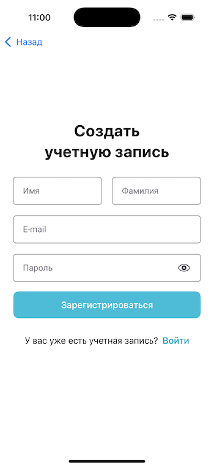

# Elsa
Чат-ассистент для выполнения пользовательских команд.

## Особенности
* SwiftUI.
* Clean Architecture.
* Dependency Injection.
* DI-контейнеры.
* MVVM.
* Получение новых сообщений в реальном времени с помощью SSE (Server-Sent Events).
* Возможность просмотра истории сообщений с помощью обратной пагинации.
* Текстовые поля в стиле [Material Design](https://m3.material.io/components/text-fields/overview).
* Keychain.
* Легкое создание и добавление собственных пользовательских команд.

## Структура проекта
* `client`: содержит iOS приложение.
* `backend`: содержит серверное приложение, написанное с использованием [Vapor](https://vapor.codes).

## Экраны
### Login/Register
 

### Chat

